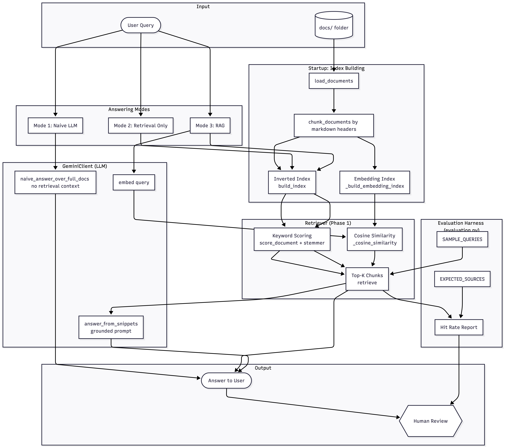

# DocuBot

DocuBot is a small documentation assistant that helps answer developer questions about a codebase. It can operate in three different modes:

1. **Naive LLM mode**  
   Sends the entire documentation corpus to a Gemini model and asks it to answer the question. No retrieval is involved.

2. **Retrieval only mode**  
   Uses a custom indexing and scoring system to retrieve relevant document sections without calling an LLM.

3. **RAG mode (Retrieval Augmented Generation)**  
   Retrieves the most relevant sections first, then asks Gemini to answer using only those sections as context.

---

## What I Added vs. the Starter

The starter project provided the overall structure and scaffolding: the three-mode CLI in `main.py`, the `GeminiClient` class with working LLM prompts, the docs/ folder, and the `DocuBot` class with stub methods marked TODO.

Everything below was implemented or added beyond the starter:

**Core retrieval (Phase 1 — required stubs):**
- `build_index` in `docubot.py` — builds an inverted index mapping lowercase tokens to the files they appear in
- `score_document` in `docubot.py` — counts stemmed query word matches against a document chunk
- `retrieve` in `docubot.py` — scores all chunks and returns the top-k results

**Chunking:**
- `chunk_documents` in `docubot.py` — splits documents into sections by markdown headers so retrieval operates at the section level rather than the full file level. This was not present in the starter.

**Retrieval enhancements:**
- Stemming in `score_document` — strips common suffixes so "authenticating" matches "authentication"
- Compound word splitting — splits underscore-separated words before scoring so function names like `generate_access_token` match queries like "generate token"
- Stop word filtering — removes high-frequency words like "how", "is", "the" from query scoring to reduce noise

**Embedding-based retrieval:**
- `_build_embedding_index` in `docubot.py` — pre-computes a Gemini embedding vector for every chunk at startup
- `_cosine_similarity` in `docubot.py` — computes similarity between the query embedding and each chunk embedding
- When a Gemini API key is available, `retrieve` uses cosine similarity instead of keyword scoring, enabling semantic rather than exact-match retrieval

**Prompt refinement:**
- Updated `answer_from_snippets` in `llm_client.py` to handle partial information — the model now shares what it found and notes what is missing, rather than refusing entirely when context is incomplete

**Bug fix:**
- Fixed a tuple unpacking bug in `evaluation.py` line 70 where retrieved results were unpacked as 2-tuples but `retrieve()` returns 3-tuples `(filename, heading, text)`

---

## System Architecture



---

## Setup

### 1. Install Python dependencies

    pip install -r requirements.txt

### 2. Configure environment variables

Copy the example file:

    cp .env.example .env

Then edit `.env` to include your Gemini API key:

    GEMINI_API_KEY=your_api_key_here

If you do not set a Gemini key, you can still run retrieval only mode (mode 2). Modes 1 and 3 require the key, and embedding-based retrieval also requires it.

---

## Running DocuBot

Start the program:

    python main.py

Choose a mode:

- **1**: Naive LLM (Gemini answers from general knowledge, no retrieval)
- **2**: Retrieval only (no LLM, returns raw matched sections)
- **3**: RAG (retrieval + Gemini, grounded answers)

You can use the built-in sample queries or type your own.

---

## Sample Output

**Mode 2 — Retrieval only**

```
Question: Where is the auth token generated?

Retrieved snippets:
[AUTH.md - Authentication Guide]
Tokens are created by the generate_access_token function inside auth_utils.py.
They are signed using the AUTH_SECRET_KEY environment variable.

Clients authenticate by sending a POST request to /api/login. They receive
a token which must be included in the Authorization header for all future
requests.

A token can be refreshed using POST /api/refresh.
```

**Mode 3 — RAG**

```
Question: What environment variables are required for authentication?

Answer:
Based on the documentation in AUTH.md and SETUP.md, two environment variables
are required: AUTH_SECRET_KEY, which is used to sign access tokens, and
DATABASE_URL, which is required to run the application. AUTH_SECRET_KEY is
specifically called out as a dependency of the token generation process.
```

**Mode 3 — RAG (out-of-scope query)**

```
Question: Is there any mention of payment processing in these docs?

Answer:
I do not know based on the docs I have.
```

---

## Running Retrieval Evaluation

    python evaluation.py

This runs the retrieval system against a set of sample queries and prints a hit rate — the fraction of queries where at least one retrieved section matched the expected source file.

Example output:

```
Running retrieval evaluation...

Evaluation Results
------------------
Hit rate: 0.88

Query: Where is the auth token generated?
  Expected:  ['AUTH.md']
  Retrieved: ['AUTH.md', 'SETUP.md', 'API_REFERENCE.md']
  Hit:       True

Query: Is there any mention of payment processing in these docs?
  Expected:  []
  Retrieved: ['API_REFERENCE.md', 'DATABASE.md', 'AUTH.md']
  Hit:       False
```

---

## Modifying the Project

You will primarily work in:

- `docubot.py`  
  Retrieval index, scoring, chunking, and embedding logic.

- `llm_client.py`  
  Prompts and LLM response behavior.

- `dataset.py`  
  Sample queries and fallback document corpus.

---

## Requirements

- Python 3.9+
- A Gemini API key for LLM features and embedding-based retrieval (modes 1 and 3)
- No database, no server setup, no external services besides Gemini API calls
